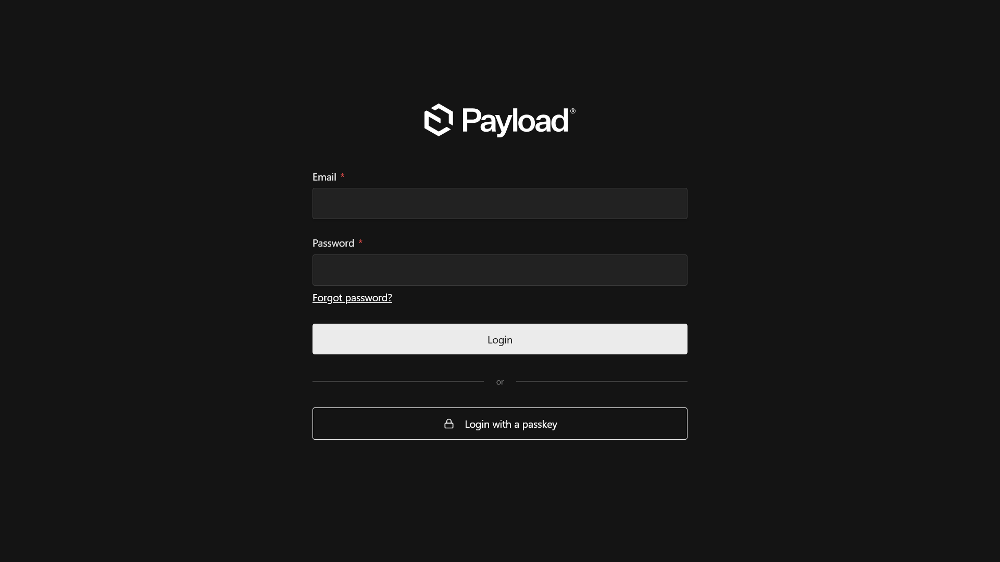
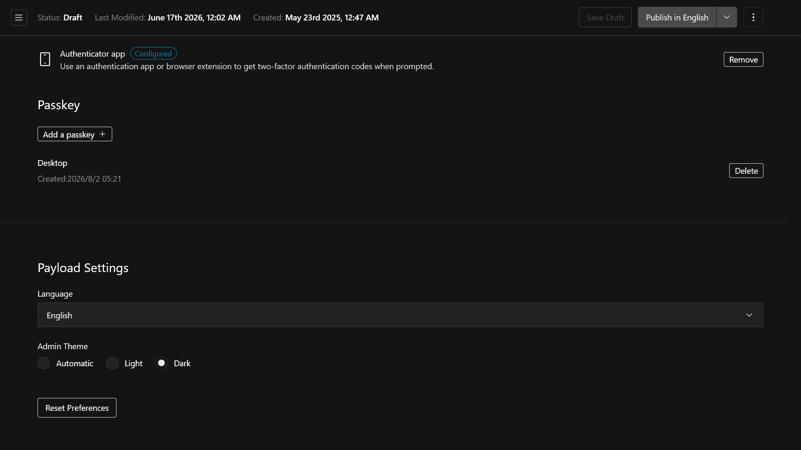

# payload-passkey

This plugin adds passkey support to [Payload CMS](https://github.com/payloadcms/payload) using [Better Auth](https://github.com/better-auth/better-auth).

Although it is a wrapper around [@delmaredigital/payload-better-auth](https://github.com/delmaredigital/payload-better-auth/), this plugin focuses specifically on passkeys. It preserves Payload's default login screen and uses Payload's UI components to match Payload's design language.





## Features

- Adds a passkey login button to Payload's login screen
- Adds passkey management functionality to the account management screen
- Supports automatic token refresh when enabled in the Payload configuration
- Supports use alongside [Payload TOTP](https://github.com/GeorgeHulpoi/payload-totp)
- i18n support (beta)

Depending on the user's setup, they can log in using one of the following methods:

- Users who do not use Payload TOTP, or who use Payload TOTP but have not configured TOTP: (email address AND password) OR passkey
- Users who use Payload TOTP and have configured TOTP: (email address AND password AND TOTP) OR passkey

## Installation

```bash
pnpm add payload-passkey
```

## Basic Usage

```env
# .env
BETTER_AUTH_SECRET=your-secret-key-longer-than-32-characters
```

```ts
// payload.config.ts
import { buildConfig } from "payload";
import { payloadPasskey } from "payload-passkey";

const config = buildConfig({
    collections: [
        {
            slug: "users",
            auth: true,
            fields: [...],
        },
    ]
    plugins: [
        payloadPasskey({
            enableTotpCompatibility: true,
            rpID: "your-domain.example.com",
            rpName: "Example App",
            origin: "https://your-domain.example.com",
            modelName: "user",
            userCollection: "users",
            baseURL: "https://your-domain.example.com",
            secret: process.env.BETTER_AUTH_SECRET,
            trustedOrigins: ["https://your-domain.example.com"],
            generateId: "serial"
        })
    ]
});

export default config;
```

Once configured, run the database migrations. If you are using Payload's default authentication strategy, you do not need to update users' passwords; running the database migrations is sufficient.

```bash
npm run payload migrate:create
npm run payload migrate
```

### Using with Payload TOTP

This plugin can also be used alongside Payload TOTP.

```ts
// payload.config.ts
import { buildConfig } from "payload";
import { payloadPasskey } from "payload-passkey";

const config = buildConfig({
    collections: [
        {
            slug: "users",
            auth: true,
            fields: [...],
        },
    ]
    plugins: [
        payloadPasskey({
            enableTotpCompatibility: true,
            rpID: "your-domain.example.com",
            rpName: "Example App",
            origin: "https://your-domain.example.com",
            modelName: "user",
            userCollection: "users",
            baseURL: "https://your-domain.example.com",
            secret: process.env.BETTER_AUTH_SECRET,
            trustedOrigins: ["https://your-domain.example.com"],
            generateId: "serial"
        }),
        // `payloadTotp()` must be called after `payloadPasskey()`;
        // otherwise, the collection generated by payload-passkey won't be protected by Payload TOTP.
        payloadTotp({
            collection: "users",
            totp: {
                issuer: "Example App"
            }
        })
    ]
});

export default config;
```

Once configured, run the database migrations. If you are using Payload's default authentication strategy, you do not need to update users' passwords; running the database migrations is sufficient.

```bash
npm run payload migrate:create
npm run payload migrate
```

## Options

For all available options and their descriptions, see the documentation for [PayloadPasskeyOptions](./docs/api/type-aliases/PayloadPasskeyOptions.md).

## Acknowledgements

This plugin is a wrapper around @delmaredigital/payload-better-auth and Better Auth. Some of the component code was based on @delmaredigital/payload-better-auth.

<details>
    <summary>@delmaredigital/payload-better-auth</summary>
MIT License

Copyright (c) 2026 Delmare Digital

Permission is hereby granted, free of charge, to any person obtaining a copy
of this software and associated documentation files (the "Software"), to deal
in the Software without restriction, including without limitation the rights
to use, copy, modify, merge, publish, distribute, sublicense, and/or sell
copies of the Software, and to permit persons to whom the Software is
furnished to do so, subject to the following conditions:

The above copyright notice and this permission notice shall be included in all
copies or substantial portions of the Software.

THE SOFTWARE IS PROVIDED "AS IS", WITHOUT WARRANTY OF ANY KIND, EXPRESS OR
IMPLIED, INCLUDING BUT NOT LIMITED TO THE WARRANTIES OF MERCHANTABILITY,
FITNESS FOR A PARTICULAR PURPOSE AND NONINFRINGEMENT. IN NO EVENT SHALL THE
AUTHORS OR COPYRIGHT HOLDERS BE LIABLE FOR ANY CLAIM, DAMAGES OR OTHER
LIABILITY, WHETHER IN AN ACTION OF CONTRACT, TORT OR OTHERWISE, ARISING FROM,
OUT OF OR IN CONNECTION WITH THE SOFTWARE OR THE USE OR OTHER DEALINGS IN THE
SOFTWARE.
</details>
